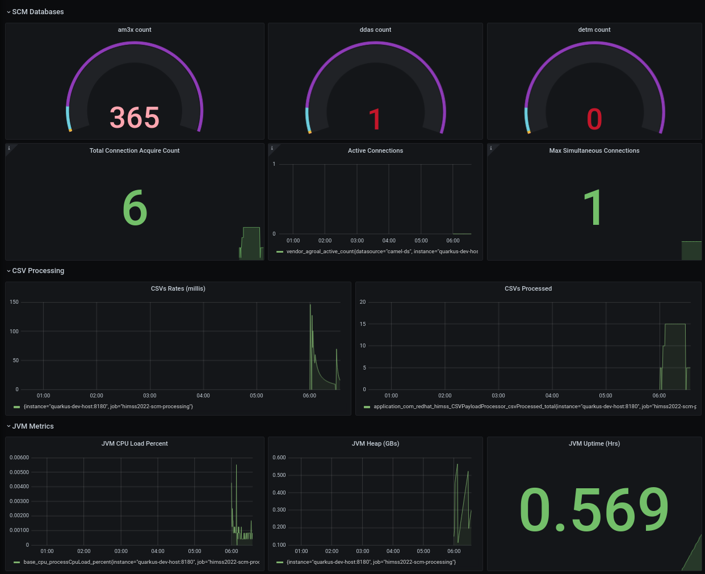

:scrollbar:
:data-uri:
:toc2:
:linkattrs:

= himss_2022_scm_integration
:numbered:

== Overview

TO-DO

== Technical Discussion Vectors

. *Events in Motion*
.. Use of Red Hat AMQ Streams
.. Visibility of events via KafDrop

. *Polyglot App Frameworks*
.. Quarkus
.. Camel

. *Operations*
.. *Ansible*
... Ansible is used for automated and repeatable deployment of Application Services to OpenShift

.. *Monitoring*
... Business Dashboards using Grafana's Postgresql driver
... Operational Dashboards using Grafana's Prometheus driver
... Quarkus micro-profile metrics scraped by Prometheus

.. *App Scalability*
... Knative Serverless is used to auto-scale HTTP based _scm-frontend_ service
... Keda is used to auto-scale async kafka based _scm-backend_ service

== Deploy to OpenShift using Ansible

Ansible is included to deploy this application to OpenShift in a repeatable manner.

=== Pre-reqs:

. OpenShift Container Platform version 4.7.* or more recent. Resource requirements needed by the app (doesn’t include resource requirements of Openshift to support itself) is as follows:

.. RAM: 6 GB

.. CPU: 8

.. Storage: 10 PVCs of type RWO (no RWX requirement) and each of size 5 GiB

. cluster-admin credentials to this OpenShift cluster are needed

. Corresponding oc utility installed locally
+
All versions of this utility are available at either of the following:

.. https://access.redhat.com/downloads/content/290
+
RHN subscription required

.. https://mirror.openshift.com/pub/openshift-v4/clients/ocp/?C=M;O=D
+
Accessible without a RHN subscription

. ansible installed locally
+
ie: dnf install ansible

. git installed locally

=== Procedure:

. Using the oc utility that corresponds to the version of OpenShift that you will deploy to, log into the cluster:
+
-----
$ oc login <OCP API Server url> -u <cluster-admin userId> -p <passwd>
-----

. Clone the source code of this project:
+
-----
$ git clone https://github.com/redhat-naps-da/himss_2022_scm_integration
-----

. Change to the ansible directory of this project:
+
-----
$ cd ansible
-----

. Deploy to OpenShift:
+
-----
$ ansible-playbook playbooks/install.yml
-----

.. Deployment should complete in about 10 minutes.

.. Notice the creation of a new OCP namespace where the application resides: _user1-himss2022-scm_

.. At the completion of the installation, expect to see messages similar to the following:
+
-----
PLAY RECAP *******************************************************************************************************************************************************************************************************

    localhost                  : ok=93   changed=27   unreachable=0    failed=0    skipped=16   rescued=0    ignored=0

-----

. Optional: Uninstall from OpenShift:
+
-----
$ ansible-playbook playbooks/uninstall.yml
-----

== Smoke Test

. Set environment variable to _scm-frontend_ route exposed by KNative:app-name:
+
-----
$ SCM_FRONTEND_HOST=$(oc get kservice scm-frontend -n user1-himss2022-scm --template='{{ .status.url }}' | sed 's/"//g')
-----

. Execute smoke test:
+
-----
$ cd scm-frontend 

$ curl -v -X POST \
    -F "data=@src/test/himss/good/AM3X-034540-6636-2-19710723.tgz" \
    -F "data=@src/test/himss/good/DETM-NKI7I92LX7P-5221-6-20000907.tgz" \
    $SCM_FRONTEND_HOST/gzippedFiles
-----

. Expected response should be similar to the following: 
+
-----
* Connection #0 to host scm-frontend-user1-himss2022-scm.apps.cluster-7c8qw.7c8qw.sandbox1691.opentlc.com left intact
ALL FILES PERSISTED
-----

. The log of the _scm-backend_ pod should include statements such as the following: 
+
-----
19:15:25 INFO  [co.re.hi.Routes] (Camel (camel-1) thread #4 - KafkaConsumer[topic-scm-file]) CSVPayloadProcessor.process() DETM-NKI7I92LX7P-5221-6-20000907.txt :   # of rows = 200
19:15:25 WARN  [co.re.hi.Routes] (Camel (camel-1) thread #4 - KafkaConsumer[topic-scm-file]) will intentionally delay persist by the following millis: 1,000
19:15:25 INFO  [co.re.hi.Routes] (Camel (camel-1) thread #3 - KafkaConsumer[topic-scm-file]) CSVPayloadProcessor.process() AM3X-034540-6636-2-19710723.txt :   # of rows = 200
19:15:25 WARN  [co.re.hi.Routes] (Camel (camel-1) thread #3 - KafkaConsumer[topic-scm-file]) will intentionally delay persist by the following millis: 1,000
-----

== Load Test

TO-DO

== Demo Components

The purpose of this section is to highlight the major components of the demo.

TO-DO

=== Grafana Dashboard

. Grafana Admin credentials:  

.. Local environment:  _admin / admin_
.. OCP environment:
+
-----
$ POD=$(oc get pod -n user1-himss2022-scm | grep "^grafana-deployment" | awk '{print $1}')
$ oc rsh -c grafana $POD env | grep GF_SECURITY_ADMIN_
-----

. First draft 
+

== Development
=== App Metrics

. View microprofile generated metrics in JSON format
+
-----
$ curl -H"Accept: application/json" localhost:8180/q/metrics/application 
-----
+
Example result:
+
-----
    {
    "com.redhat.himss.CSVPayloadProcessor.csvProcessed": 5,
    "com.redhat.himss.CSVPayloadProcessor.csvProcessingTimer": {
        "p99": 25.541904,
        "min": 5.51574,
        "max": 25.541904,
        "mean": 14.2945098,
        "p50": 13.453519,
        "p999": 25.541904,
        "stddev": 6.474391748917466,
        "p95": 25.541904,
        "p98": 25.541904,
        "p75": 14.892466,
        "fiveMinRate": 0.013991112279011392,
        "fifteenMinRate": 0.005240759238950647,
        "meanRate": 0.0746185181247482,
        "count": 5,
        "oneMinRate": 0.034748554162230876,
        "elapsedTime": 71.472549
    },
    "com.redhat.himss.ValidationException.dirtyCSVDataCount": 0

-----

. View microprofile generated metrics in OpenMetrics format:
+
-----
$ curl  localhost:8180/q/metrics/application
-----
+
Example result:
+
-----
# HELP application_com_redhat_himss_CSVPayloadProcessor_csvProcessed_total How many csv payloads have been processed.
# TYPE application_com_redhat_himss_CSVPayloadProcessor_csvProcessed_total counter
application_com_redhat_himss_CSVPayloadProcessor_csvProcessed_total 5.0
# TYPE application_com_redhat_himss_CSVPayloadProcessor_csvProcessingTimer_rate_per_second gauge
application_com_redhat_himss_CSVPayloadProcessor_csvProcessingTimer_rate_per_second 0.00520411558035244
# TYPE application_com_redhat_himss_CSVPayloadProcessor_csvProcessingTimer_one_min_rate_per_second gauge
application_com_redhat_himss_CSVPayloadProcessor_csvProcessingTimer_one_min_rate_per_second 1.1553424142673022E-8
# TYPE application_com_redhat_himss_CSVPayloadProcessor_csvProcessingTimer_five_min_rate_per_second gauge
application_com_redhat_himss_CSVPayloadProcessor_csvProcessingTimer_five_min_rate_per_second 7.082833577637795E-4
# TYPE application_com_redhat_himss_CSVPayloadProcessor_csvProcessingTimer_fifteen_min_rate_per_second gauge
application_com_redhat_himss_CSVPayloadProcessor_csvProcessingTimer_fifteen_min_rate_per_second 0.001938708318900107
# TYPE application_com_redhat_himss_CSVPayloadProcessor_csvProcessingTimer_min_seconds gauge
application_com_redhat_himss_CSVPayloadProcessor_csvProcessingTimer_min_seconds 0.00551574
# TYPE application_com_redhat_himss_CSVPayloadProcessor_csvProcessingTimer_max_seconds gauge
application_com_redhat_himss_CSVPayloadProcessor_csvProcessingTimer_max_seconds 0.025541904
# TYPE application_com_redhat_himss_CSVPayloadProcessor_csvProcessingTimer_mean_seconds gauge
application_com_redhat_himss_CSVPayloadProcessor_csvProcessingTimer_mean_seconds 0.0142945098
# TYPE application_com_redhat_himss_CSVPayloadProcessor_csvProcessingTimer_stddev_seconds gauge
application_com_redhat_himss_CSVPayloadProcessor_csvProcessingTimer_stddev_seconds 0.006474391748917466
# HELP application_com_redhat_himss_CSVPayloadProcessor_csvProcessingTimer_seconds A measure of how long it takes to process a CSV file.
# TYPE application_com_redhat_himss_CSVPayloadProcessor_csvProcessingTimer_seconds summary
application_com_redhat_himss_CSVPayloadProcessor_csvProcessingTimer_seconds_count 5.0
application_com_redhat_himss_CSVPayloadProcessor_csvProcessingTimer_seconds_sum 0.071472549
application_com_redhat_himss_CSVPayloadProcessor_csvProcessingTimer_seconds{quantile="0.5"} 0.013453519
application_com_redhat_himss_CSVPayloadProcessor_csvProcessingTimer_seconds{quantile="0.75"} 0.014892466
application_com_redhat_himss_CSVPayloadProcessor_csvProcessingTimer_seconds{quantile="0.95"} 0.025541904
application_com_redhat_himss_CSVPayloadProcessor_csvProcessingTimer_seconds{quantile="0.98"} 0.025541904
application_com_redhat_himss_CSVPayloadProcessor_csvProcessingTimer_seconds{quantile="0.99"} 0.025541904
application_com_redhat_himss_CSVPayloadProcessor_csvProcessingTimer_seconds{quantile="0.999"} 0.025541904
# HELP application_com_redhat_himss_ValidationException_dirtyCSVDataCount_total How many incidents of dirty CSV data.
# TYPE application_com_redhat_himss_ValidationException_dirtyCSVDataCount_total counter
application_com_redhat_himss_ValidationException_dirtyCSVDataCount_total 0.0

-----

== Reference

. link:https://www.dropbox.com/s/jesbtetdqhxowh8/Inside%20Vignettes%2002-04-22.pdf?dl=0[graphics]
