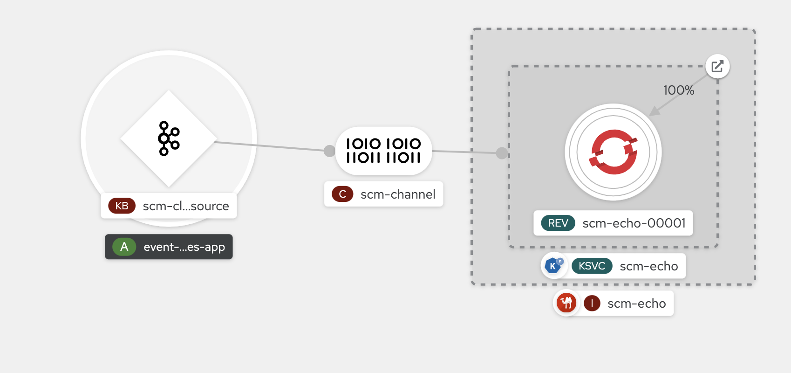
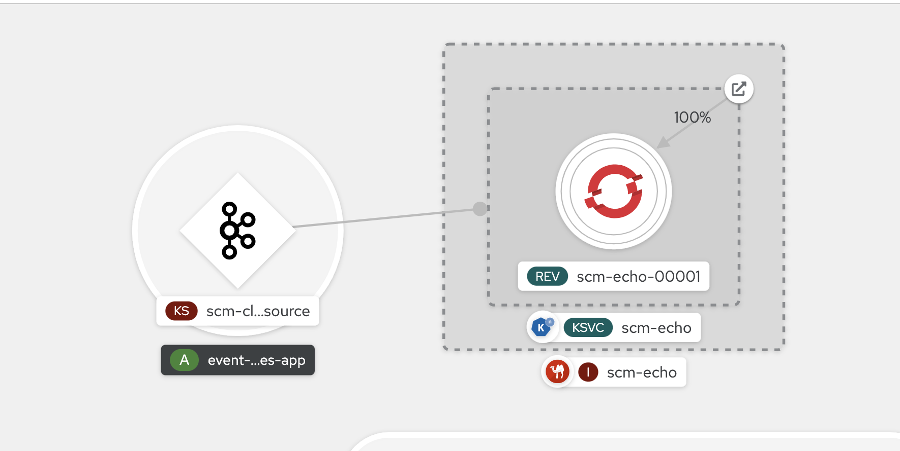

# Test serverless/kafka source infratructure
:toc:
:toclevels: 2

## Prerequisites
* Openshift 4.8 or greater
* Install OpenShift Serverless - Knative Serving, Knative Eventing
* To deploy the test service
    - Install the Camel K Operator
    - Download the Camel K CLI tool (kamel) from the Command Line Tools menu on your cluster

## create cluster and topic
```
SCM_NAMESPACE=scm-est
oc new-project $SCM_NAMESPACE
oc apply -f ../kafka/
```

## publish knative camel service

We set the max scale to 10, and the auto scaling concurrency target to 1. This should ultimately be a higher number but for this test we want to scale up faster. The value can be modified as needed.

```
#dev mode, with live coding
kamel run ScmEchoService.java --dev --name scm-echo -d camel-rest --trait knative-service.enabled=true \
 --trait knative-service.autoscaling-target=1 --trait knative-service.max-scale=10 

#just deploy
kamel run ScmEchoService.java --name scm-echo -d camel-rest --trait knative-service.enabled=true \
 --trait knative-service.autoscaling-target=1 --trait knative-service.max-scale=10
```

If this is the first time the `kamel run` command is executed, the resulting scm-echo service will take a while to deploy. To check status run if you didn't execute`kamel run` in dev mode
```
kamel get scm-echo
```

## Install the Kafka Source
There are two options:

- Use Kamelet (from Camel K) Binding as the Kafka Source
- Use Knative Kafka (OpenShift Serverless) as the Kafka Source

### Option 1: Instructions for Kamelet Kafka Source 

The Camel K Operator should be installedtab

[NOTE]
The knative service does not scale up as fast compared to a knative kafka source. With knative kafka source, the knative service scales up to 10 pods with 1000 messages, while  the kamelet kafka souce only scales up to 2 *even* with the autoscaling concurrency target set to a low number like 1. Introducing an intermediary knative channel as the sink for the Kamelet Binding for the kafka Source has the effect of scaling the pods to 10.

First install the kamelet for insecure kafka sources. It is not a default kamelet installed by the Camel K operator
```
oc apply -f https://raw.githubusercontent.com/apache/camel-kamelets/main/kamelets/kafka-not-secured-source.kamelet.yaml 
```

Publish the channel, the kamelet binding for the  kafka source, and the subscription to the knative service
```
oc apply -f scm-channel
oc apply -f kafka-source-kamelet.yaml
oc apply -f scm-channel-sub.yaml
```




### Option 2: Instructions for Knative Kafka Souce

Ensure that Knative Kafka is installed via the OpenShift Serverless Operator. When configuring KnativeK afka, only the source attribute needs to be enabled for this example. For e.g.
```yaml
apiVersion: operator.serverless.openshift.io/v1alpha1
kind: KnativeKafka
metadata:
    name: knative-kafka
    namespace: knative-eventing
spec:
    channel:
        enabled: false
    source:
        enabled: true 
```

Modify the kakfa source to update the namespace name

```
sed "s/SCM_NAMESPACE/$SCM_NAMESPACE/" kafka-source-knative.yaml | oc apply -f -
```



## Testing

### Quick test
```
oc -n kafka run kafka-producer \
    -ti --image=quay.io/strimzi/kafka:latest-kafka-2.7.0 --rm=true \
    --restart=Never -- bin/kafka-console-producer.sh \
    --broker-list scm-cluster-kafka-brokers:9092 --topic scm-file-topic

```

### Autoscale Test
```
oc run kafka-spammer -it --image=jonnyman9/kafka-python-spammer:latest --rm=true --restart=Never --env KAFKA_BOOTSTRAP_HOST=scm-cluster-kafka-brokers --env TOPIC_NAME=scm-file-topic --env TIMES=100
```

The `TIMES` env variable  can be modified to change the numner of messages generated