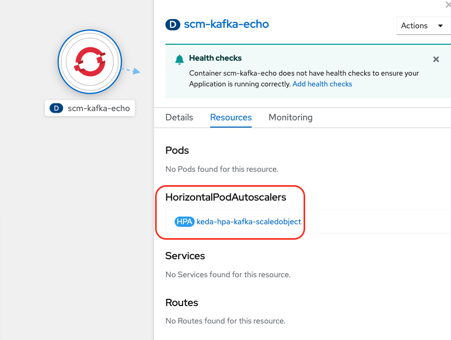

# Test Scaling Infrastructure
:toc:
:toclevels: 2

## About
This demonstrates how to scale a consumer service based on the number of messages generated with three different methods. The first two ways use a intermediary resource to consume messages from a kafka topic and forwards the messages via HTTP to the service. https://cloud.redhat.com/learn/topics/serverless[OpenShift Serverless] is utilized to scale up the service based on load. The third method uses the Kubernetes Horizontal Pod Autoscaler (HPA) but simplifies the configuration by using a joint MS-Red Hat upstream project called https://keda.sh/[KEDA]. With KEDA we can scale up a non-HTTP service that consumes directly from the kafka topic based on the number of records on the topic.

## Prerequisites
* Openshift 4.8 or greater
* If scaling via Option 1 or 2:
   - Install OpenShift Serverless - Knative Serving, Knative Eventing
   - To deploy the test service
       ** Install the Camel K Operator
       ** Download the Camel K CLI tool (kamel) from the Command Line Tools menu on your cluster
* If scaling via Option 3
   - Install the KEDA Operator and create a `KedaController` in the generated keda namespace

## create cluster and topic
```
SCM_NAMESPACE=scm-est
oc new-project $SCM_NAMESPACE
oc apply -f ../kafka/
```

## publish knative camel service (If running Option 1 or 2)

We set the max scale to 10, and the auto scaling concurrency target to 1. This should ultimately be a higher number but for this test we want to scale up faster. The value can be modified as needed.

```
#dev mode, with live coding
kamel run ScmEchoService.java --dev --name scm-echo -d camel-rest --trait knative-service.enabled=true \
 --trait knative-service.autoscaling-target=1 --trait knative-service.max-scale=10 

#just deploy
kamel run ScmEchoService.java --name scm-echo -d camel-rest --trait knative-service.enabled=true \
 --trait knative-service.autoscaling-target=1 --trait knative-service.max-scale=10
```

If this is the first time the `kamel run` command is executed, the resulting scm-echo service will take a while to deploy. To check status run if you didn't execute`kamel run` in dev mode
```
kamel get scm-echo
```

## Setup Scaling
There are three options:

- Use https://camel.apache.org/camel-k/1.8.x/kamelets/kamelets.html[Kamelet] (from https://camel.apache.org/camel-k/[Camel K]) Binding as the Kafka Source
- Use Knative Kafka (OpenShift Serverless) as the Kafka Source
- Use KEDA to scale based on the number of records on the Kafka Topic 

### Option 1: Instructions for Kamelet Kafka Source 

The Camel K Operator should be installed

[NOTE]
The knative service does not scale up as fast compared to a knative kafka source. With knative kafka source, the knative service scales up to 10 pods with 1000 messages, while  the kamelet kafka souce only scales up to 2 *even* with the autoscaling concurrency target set to a low number like 1. Introducing an intermediary knative channel as the sink for the Kamelet Binding for the kafka Source has the effect of scaling the pods to 10.

First install the kamelet for insecure kafka sources. It is not a default kamelet installed by the Camel K operator
```
oc apply -f https://raw.githubusercontent.com/apache/camel-kamelets/main/kamelets/kafka-not-secured-source.kamelet.yaml 
```

Publish the channel, the kamelet binding for the  kafka source, and the subscription to the knative service
```
oc apply -f scm-channel
oc apply -f kafka-source-kamelet.yaml
oc apply -f scm-channel-sub.yaml
```

image::../docs/images/kamelet.png[]


### Option 2: Instructions for Knative Kafka Souce

Ensure that Knative Kafka is installed via the OpenShift Serverless Operator. When configuring `KnativeKafka``, only the source attribute needs to be enabled for this example. For e.g.
```yaml
apiVersion: operator.serverless.openshift.io/v1alpha1
kind: KnativeKafka
metadata:
    name: knative-kafka
    namespace: knative-eventing
spec:
    channel:
        enabled: false
    source:
        enabled: true 
```

Modify the kakfa source to update the namespace name

```
sed "s/SCM_NAMESPACE/$SCM_NAMESPACE/" kafka-source-knative.yaml | oc apply -f -
```

image::../docs/images/knative.png[]

### Option 3: Instructions for KEDA Scaling

Make sure the Keda Operator is installed and a `KedaController` has been created in the keda namespace.

Modify the customer resources to update the namespace name and create the resources

```
sed "s/SCM_NAMESPACE/$SCM_NAMESPACE/" scm-kafka-echo/src/main/keda/*.yaml | oc apply -f -
```

Confirm that the service is deployed and a `HorizontalPodAutoscaler` has been created
```
oc get deployment scm-kafka-echo && oc get hpa 
```

```
NAME             READY   UP-TO-DATE   AVAILABLE   AGE
scm-kafka-echo   0/0     0            0           4m8s
NAME                          REFERENCE                   TARGETS              MINPODS   MAXPODS   REPLICAS   AGE
keda-hpa-kafka-scaledobject   Deployment/scm-kafka-echo   <unknown>/50 (avg)   1         100       0          2m2s
```



Note: KEDA experimental features are not yet in the OpenShift serverless version of knative
but see https://github.com/knative-sandbox/eventing-autoscaler-keda

## Testing

### Quick test
```
oc -n kafka run kafka-producer \
    -ti --image=quay.io/strimzi/kafka:latest-kafka-2.7.0 --rm=true \
    --restart=Never -- bin/kafka-console-producer.sh \
    --broker-list scm-cluster-kafka-brokers:9092 --topic scm-file-topic

```

### Autoscale Test
```
oc run kafka-spammer -it --image=jonnyman9/kafka-python-spammer:latest --rm=true --restart=Never --env KAFKA_BOOTSTRAP_HOST=scm-cluster-kafka-brokers --env TOPIC_NAME=scm-file-topic --env TIMES=100
```

The `TIMES` env variable  can be modified to change the numner of messages generated

Once you run, notice that the number of pods are autoscaled